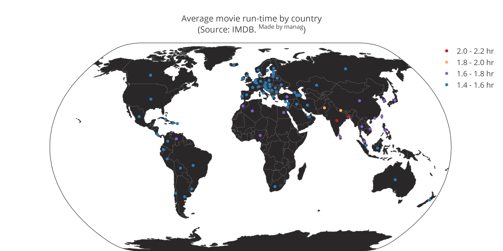

# imdb_movie_runtime

### Task:
* Determine average movie runtime by country from IMDB data and plot it on a map.
* Do the same with for Indian movies by language.

### Steps
1. Obtain [IMDB data](ftp://ftp.fu-berlin.de/pub/misc/movies/database/temporaryaccess/) in list format (Files obtained: countries, language, movies and running-times)
2. Use in-house modified [imdb2json.py](https://github.com/oxplot/imdb2json/blob/master/imdb2json.py) with [convert_IMDB_list_to_json.py](./src/convert_IMDB_list_to_json.py)
to convert IMDB list format to JSON format. Note: This modified imdb2json.py is not made available here as I am not certain about its license terms
3. Convert JSON data to TSV format using [convert_IMDB_json_to_tsv.py](./src/convert_IMDB_json_to_tsv.py)
4. Combine TSV data obtained from multiple IMDB files using [analyze_imdb_data.ipynb](./analysis/analyze_imdb_data.ipynb) and determine mean movie runtime by country
5. Pair the data with geo-coordinates from [developers.google.com](https://developers.google.com/public-data/docs/canonical/countries_csv) and [this github repo](https://github.com/lukes/ISO-3166-Countries-with-Regional-Codes)
6. Plot it on map using [plot_imdb_runtime_on_map.ipynb](./analysis/plot_imdb_runtime_on_map.ipynb)
7. Plot average length of movies in Indian map by language using [plot_india_by_language.ipynb](./analysis/plot_india_by_language.ipynb). Map source: [ArcGIS](https://www.arcgis.com/home/item.html?id=cf9b387de48248a687aafdd4cdff1127)

### Results
**Average movie length by country**

Interactive version of this chart is available at [plot.ly](https://plot.ly/~mana_plotly/24/)

**Average Indian movie length by language**
{:height="50%" width="50%"}

**Scatter plot version of the world movies chart:**

Interactive version of this chart is available at [plot.ly](https://plot.ly/~mana_plotly/22/)

### License
Code in this repository is distributed under MIT license.